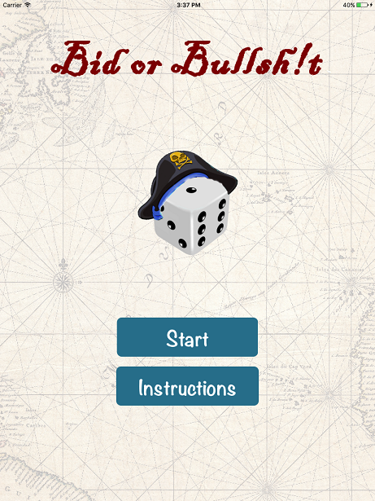
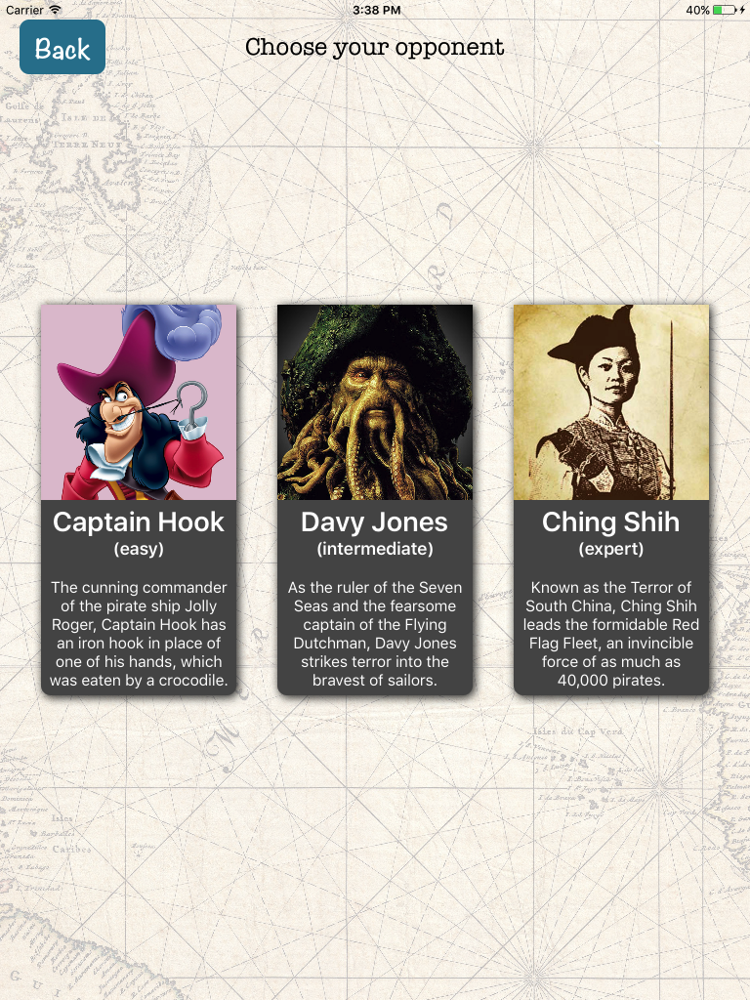
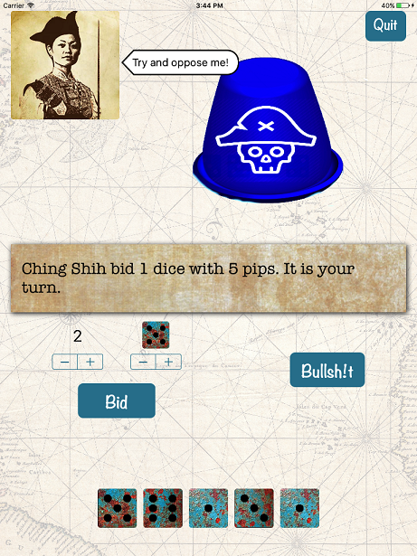

# Bid or Bullsh!t
### A game of wit and deception for the iPad with a built-in ACT-R opponent.

Created for the course Cognitive Modelling: Complex Behaviour (April 2017) together with Pim van der Meulen and Kim van Prooijen.

This game is a pirate-themed adaptation of the dice game [Perudo/Dudo/Liar's Dice](http://www.perudo.com/) for one player with an AI opponent.

The AI opponent is an [ACT-R](https://github.com/ntaatgen/ACT-R) model which can shift between a novice rule-based strategy (for inexperienced players), and a more advanced memory-based one (for players who want a bigger challenge).

## Screenshots

  

## Usage
You can import the repository into XCode using `Source Control` -> `Check Out...` and entering the URL https://github.com/maartenvandervelde/bid-or-bullshit.git.
